# scut_padavan使用指南 <!-- omit in toc -->

*最后更新日期：2019年9月27日*

*本文档的部分内容仅保证在最后更新日期时有效*

*本文档的最新版本可在[这里](https://github.com/hanwckf/scut_padavan_guide/blob/master/guide.md)和[这里](https://gitee.com/hanwckf/scut_padavan_guide/blob/master/guide.md)获得*

***
本作品采用[知识共享署名-非商业性使用-相同方式共享 4.0 国际许可协议](https://creativecommons.org/licenses/by-nc-sa/4.0/)进行许可。


***
## FAQ <!-- omit in toc -->
- 本固件的WiFi的默认名称和密码是？
  - 对于极路由E30/HC5861B/Enjoy1200
    - 默认SSID：`HC5861B_XXXX`和`HC5861B_5G_XXXX`，默认密码都是`1234567890`
  - 其它机器的默认SSID格式`<机器型号>_<MAC后4位>`以及`<机器型号>_5G_<MAC后4位>`，默认密码都是`1234567890`
- 如何进入本固件的管理界面（默认配置下）？
  - 用有线或无线方式连入路由器并配置成自动获取IP地址，用浏览器访问：`192.168.2.1` ，也可以使用域名 `http://my.router`
- 本固件的管理界面的默认登录账号密码是？
  - 默认用户名：`admin`，默认密码：`admin`，ssh/telnet用户名密码同上
- 我更换了宿舍或者重置了校园网的账号密码，需要在路由器上怎么做？
  - 重新做一次快速配置即可，见[第2节](#快速配置指南)
- 如何重新设置WiFi密码？
  - 见[第2节](#快速配置指南)末尾
- 如何查看scutclient的日志？
  - 见[第3节](#简单故障排查)的内容
- 如何重启路由器？
  - 拔掉电源再插回去，或在管理界面点重启按钮。切勿长按RESET键，这样是恢复出厂设置。
- 如何进入breed？
  - 电脑有线网卡配置成自动获取IP地址，然后连到路由器的任一LAN口，路由器先按住RESET按键后再上电，等待10秒后松开RESET键，然后在电脑浏览器里访问 `192.168.1.1` ，注意breed的IP地址与本固件的默认IP地址(`192.168.2.1`)不同。对于没有RESET键或者breed未适配的机型，请使用BreedEnter工具进入Breed

<div STYLE="page-break-after: always;"></div>

## 目录 <!-- omit in toc --> 
1. [介绍](#介绍)
2. [快速配置指南](#快速配置指南)
3. [简单故障排查](#简单故障排查)
4. [如何将路由器恢复出厂设置](#如何将路由器恢复出厂设置)
5. [IPv6](#ipv6)
6. [本固件的其它内置功能](#本固件的其它内置功能)
7. [如何在其它网络环境下使用本固件](#如何在其它网络环境下使用本固件)
8. [如何重刷或者刷入其它固件](#如何重刷或者刷入其它固件)
9. [如何获取固件更新](#如何获取固件更新)
10. [如何备份EEPROM, EEPROM丢失了怎么办](#如何备份eeprom-eeprom丢失了怎么办)
11. [如何进入路由器的控制台终端](#如何进入路由器的控制台终端)
12. [如何选择其它路由器](#如何选择其它路由器)
13. [其它关于校园网的信息](#其它关于校园网的信息)

<div STYLE="page-break-after: always;"></div>

## 介绍

本文档使用的scut_padavan为完全开源的路由器固件，**与OpenWrt没有任何关系**，是来自俄罗斯的[Padavan](https://bitbucket.org/padavan/rt-n56u)项目的一个Fork，民间俗称老毛子，仅适用于MT7620/7621/7628平台的路由器。

由于MTK系列的无线方案在开源mt76驱动下的性能和稳定性不及原厂驱动，因此很多MTK路由器玩家会选择PandoraBox(PanguBox),高恪或Padavan等使用MTK私有无线驱动的固件。

*注1：高通平台的开源无线驱动ath10k/ath9k支持良好，如果需要OpenWrt的话推荐选择高通平台的路由器*  
*注2：PandoraBox(PanguBox)以及高恪同样使用mtk的私有无线驱动，但固件本身不开源*

scut_padavan最新的源代码在以下两个仓库里分发：
- [https://github.com/hanwckf/rt-n56u](https://github.com/hanwckf/rt-n56u)
- [https://gitee.com/hanwckf/rt-n56u](https://gitee.com/hanwckf/rt-n56u)

scut_padavan集成的scutclient为[原项目](https://github.com/scutclient/scutclient)的一个Fork，其源码可以在以下仓库里找到：

- [https://github.com/hanwckf/scutclient](https://github.com/hanwckf/scutclient)

目前scut_padavan中使用的scutclient源码版本为v3.0或v3.1.2；scut_padavan有监测脚本处理认证失败的情况，无需任何额外配置，客户端意外掉线后会自动重拨并记录到系统日志中。

极路由E30/HC5861B/Enjoy1200(以下简称极路由E30)是本项目支持的机型之一，目前本文档使用的参考机型为此款路由，如果你使用的是scut_padavan项目支持的其它路由器，也可以参考本文档进行配置。

极路由E30的硬件配置如下：
- CPU/2.4GHz WiFi: MT7628A (iPA+iLNA)
- RAM: 128M
- FLASH: 16M
- 5GHz WiFi: MT7612E (iPA+iLNA)

截至最后更新日期，此款已经停产的路由器可以在二手市场以较低的价格(40-70元不等)购买到，是同价位中支持5GHz WiFi最便宜的路由器之一，其它同类机器有小米路由Mini和斐讯K2(40-80元不等)等，也是支持5GHz WiFi的低价路由器。你也可以选择scut_padavan项目支持的其它路由器，如DIR-882, K2P等MT7615+MT7621方案的路由器(200元以上,性能强大)，或者是NEWIFI3等MT7621矿渣路由器(千兆,100元全新,WiFi信号可能很差)，只要刷入scut_padavan即可按本文档的后续内容配置。scut_padavan支持的机型可在[此处](https://github.com/hanwckf/rt-n56u/blob/master/README.md)看到。

**新手注意：千万不要购买没有刷好breed的路由器！因为大部分路由器从原厂固件刷入breed操作繁琐，新手操作很可能会导致路由器变砖，必须让卖家帮忙刷好breed才可购买，然后再按照本文档说明进行[刷机](#如何重刷或者刷入其它固件)配置，或者可以一步到位让热心的卖家帮忙刷好scut_padavan，只需将对应机器的固件发给卖家即可，想要获取最新固件请看[这里](#如何获取固件更新)的内容。**

**一些出售所谓校园网专用路由器的商家，把成本更低的机器(无5GHz WiFi的单MT7620/7628, AR9341或AR7241+AR9287)卖到上百元的高价，而读完这篇文档后，你完全可以自主选择性价比更高的路由器，同时也具备了一个玩家所需要的基础知识。**

对于只刷好breed但是没有刷入scut_padavan的路由器，请参考[这里](#如何重刷或者刷入其它固件)在breed中刷入本固件。

有关于scut_padavan的其它问题，可以在[Github issues](https://github.com/hanwckf/rt-n56u/issues)提问，或者发送邮件到 `hanwckf@vip.qq.com`

<div STYLE="page-break-after: always;"></div>

## 快速配置指南

对于已经刷好了scut_padavan固件的路由器，普通用户仅需执行此快速配置即可。  
一般情况下只需5分钟即可完成快速配置。

    准备工作：
      - 正常工作的网线，最好有2条，1条也可以

1. 记录以下必要信息，也可以用电脑里保存的旧信息
   
   >- 校园网登录用户名和密码，用户名一般是学号，密码默认是身份证后8位
   >- 网络中心分配的IP地址、网关和子网掩码，以及你提交的MAC地址，可以去[网上营业厅](http://net.scut.edu.cn:8091)或圈存机查看

2. 将路由器接好电源，通电

3. **如果你拿到的路由器是别人用过的，请通电两分钟后长按RESET键（对于极路由E30，RESET键在机器的底面）直到路由器自动重启，这样做的目的是恢复出厂设置。如果你的机器没有RESET键或者固件未适配，请看[这里](#如何将路由器恢复出厂设置)的方法2或方法3恢复出厂设置。**

4. 将墙壁上的网线插孔与路由器的WAN口(对于极路由E30，就是那个**蓝色**的网口)连接起来，切勿插错网口！

5. 把电脑与路由器任意一个LAN口(对于极路由E30，就是四个**黄色**的LAN口之一)连接起来，**同时暂时关闭电脑的WiFi**
   
   - 如果你的电脑没有有线网卡或者你只有一根网线，可以使用WiFi连接本路由器。在路由器启动完成之后会出现两个热点，对于极路由E30，WiFi名称默认是`HC5861B_XXXX`和`HC5861B_5G_XXXX`，WiFi默认密码都是`1234567890`  
   - **如果你只有Mac OS X或手机，可以使用WiFi连接路由器，然后跳到第12步**   
   - **新手注意：如果电脑以前是直连有线校园网的话必须经过第6-9步的操作才能使用路由器有线上网（因为直连校园网需要将电脑的有线网卡配置为静态地址，而路由器要求电脑有线网卡配置为自动获取地址），除非你的电脑只用路由器的WiFi（因为WiFi默认就是自动获取地址，一般无需配置）**

6. 按下`Win+R`，输入`control`，确定，打开控制面板

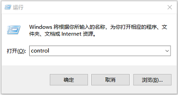

<div STYLE="page-break-after: always;"></div>

7. 在控制面板中，切换查看方式为`类别`，然后点击`查看网络状态和任务`
    
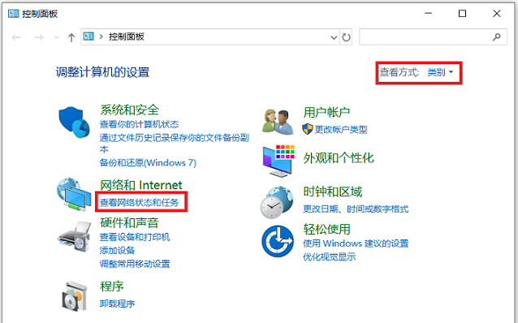

8. 点击`更改适配器设置`
    
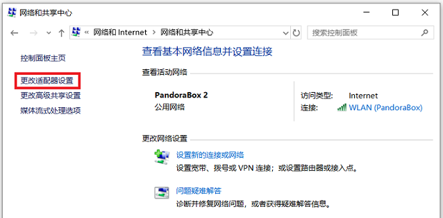

<div STYLE="page-break-after: always;"></div>

9. 把有线网卡的IP地址设置成自动获取，**如果你现在使用WiFi连接路由器则无需这一步操作**

    找到电脑的有线网卡，一般情况下它的名字为`以太网`，并且很可能带有`Realtek`之类的字符，有线网卡**绝不会带有WiFi信号图标和蓝牙图标**，如下图所示。如果你插好了网线并且路由器正常开机的话，该网卡的图标上就不会带有×号。右键单击你的有线网卡，选择`属性`

    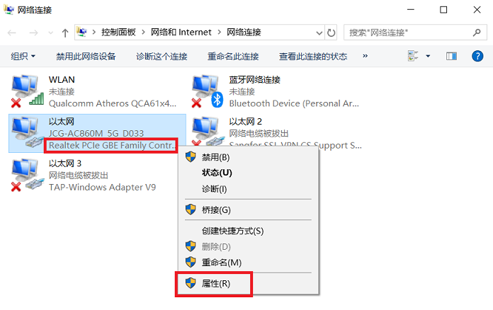

    先点一下`Internet协议版本4 (TCP/IPv4)`，再点一下`属性`，选择自动获取IP地址后确定保存

    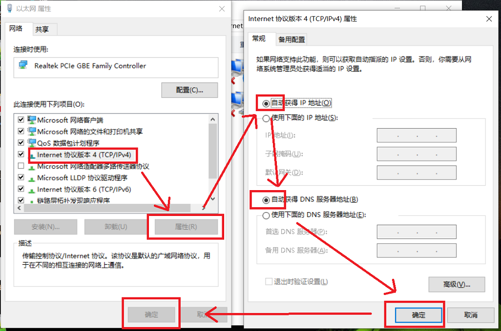

<div STYLE="page-break-after: always;"></div>

10. 查看有线或无线网卡的状态信息，确保电脑已经获取到了192.168.2.X的IP地址。找到你的有线网卡或无线网卡并双击它。一般情况下有线网卡的名字是`以太网`，无线网卡的名字是`WLAN`
    
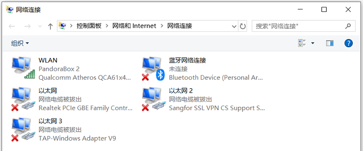

11. 点击`详细信息`，检查IP地址是否为192.168.2.X，下图为有线网卡的示例，无线网卡同理
    
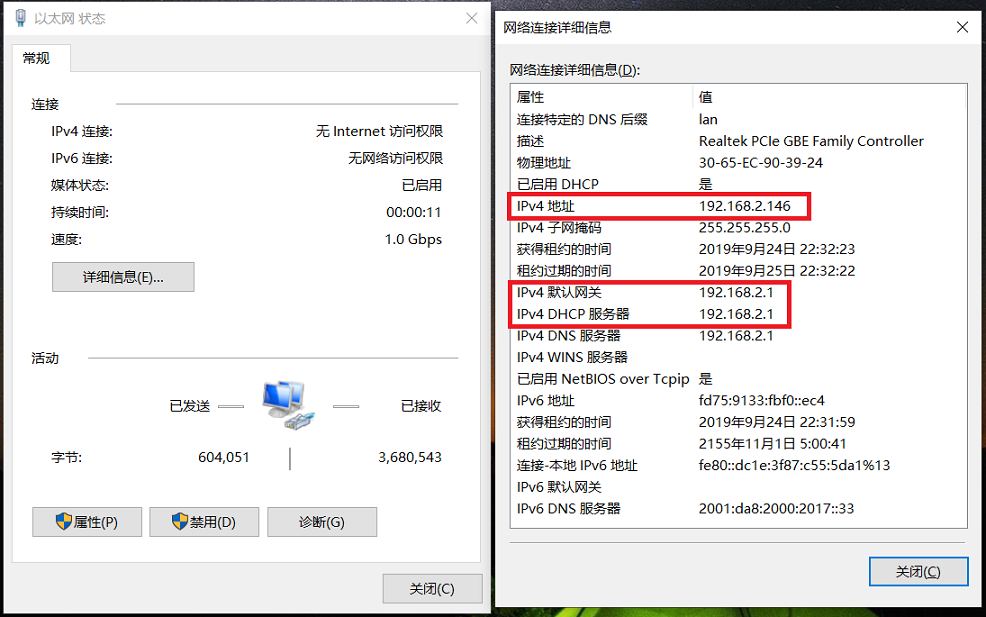

<div STYLE="page-break-after: always;"></div>

12. 打开浏览器，在地址栏输入`192.168.2.1`，按回车，弹出认证界面，输入用户名`admin`和默认密码`admin`登入管理界面。（手机和Mac OS X同理，用各自的浏览器访问`192.168.2.1`）

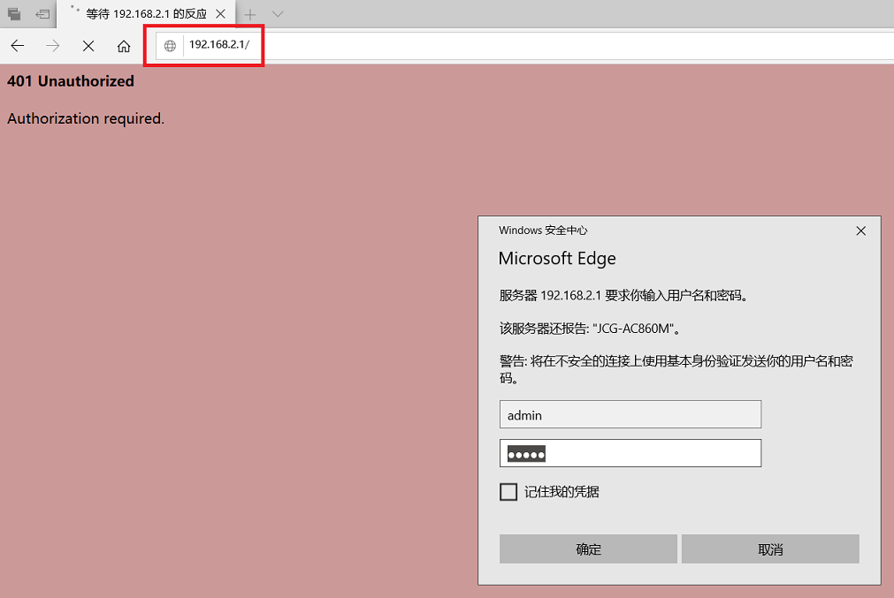

<div STYLE="page-break-after: always;"></div>

13. 在管理界面内，首先按照下图配置`外部网络(WAN)`，填入先前记录的`IP地址、子网掩码和网关`，而DNS服务器可以填写跟网上营业厅给的不一样的，可按照图片里的填。至于MAC地址，由于目前不会校验客户端MAC，所以可留空或者填入先前记录好的MAC地址(去掉`:`后填入)。填写完成之后点击**应用设置**，数秒后会自动刷新。如果没有自动刷新，请手动点一下浏览器的刷新键

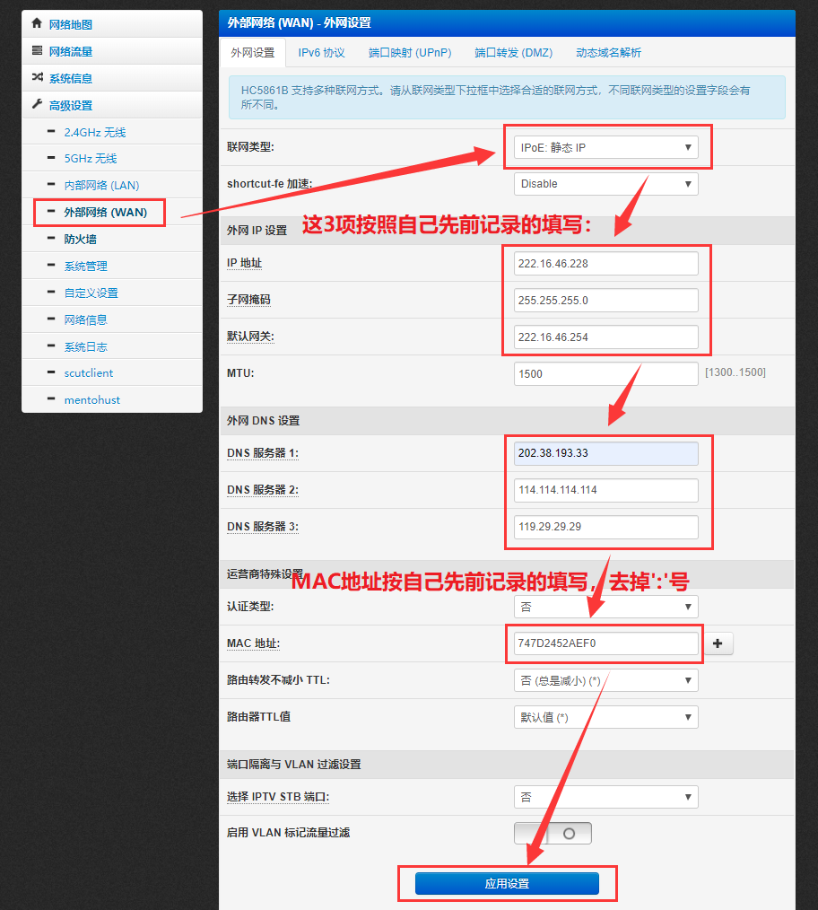

<div STYLE="page-break-after: always;"></div>

14. 然后点击左侧菜单下的`scutclient`，按下图配置，填写完成之后点击**应用设置**

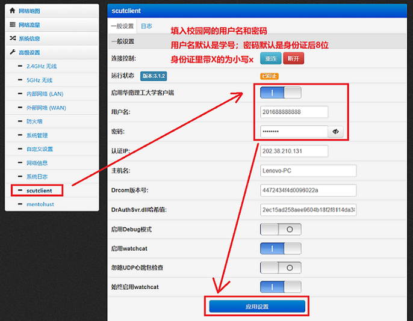

15. 查看scutclient中的日志，没有出现ERROR之类的输出说明认证成功，此时电脑应该可以正常上网了。如果认证失败，请详细检查第13-14步中填写的数值是否有误。

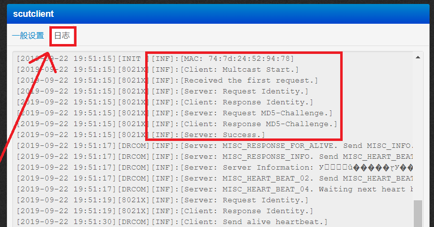

<div STYLE="page-break-after: always;"></div>

16. 按下图配置2.4GHz/5GHz WiFi的SSID和密码，密码最短要有8位，**对于大多数设备，建议使用5GHz WiFi**

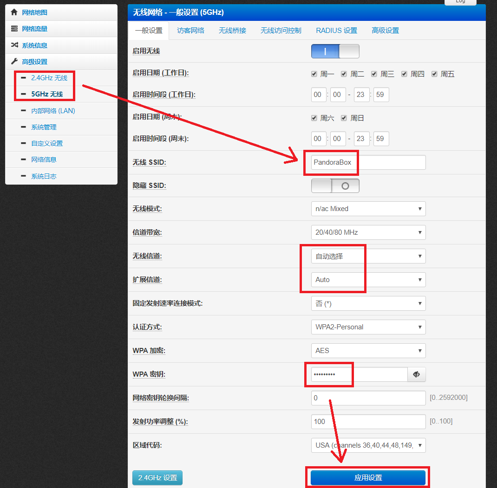

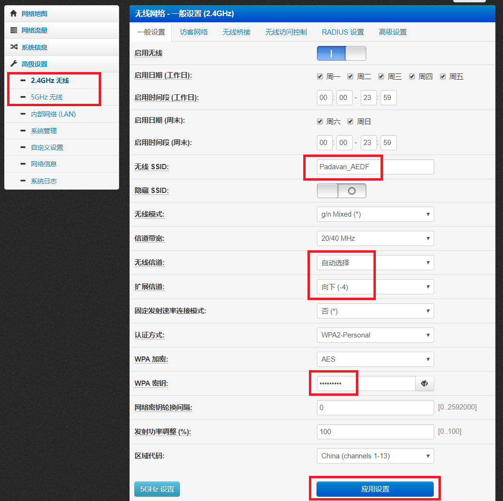

17. 快速配置完成，请在管理界面重启路由器。一切正常的话，你就可以卸载掉学校官方的上网客户端了。


<div STYLE="page-break-after: always;"></div>

## 简单故障排查

- 平时可以正常使用，突然无法上网
  - 首先请检查校园网是否欠费，然后尝试将路由器硬重启：拔掉电源再插回去
  - 如果重启完成后仍然出现本问题，请断开路由器，将电脑和墙壁上的网线插口直接相连，然后配置**有线网卡为静态地址**并填入开网时获取的信息(IP,掩码,网关)，再使用学校官方客户端进行登录测试。如果学校官方的客户端也无法正常上网，请致电网络中心(87110228)报修
  - 如果学校客户端可以正常使用，请将电脑[重新配置成自动获取IP地址](#快速配置指南)，然后把路由器按原样插回，然后登入路由器管理界面(请看FAQ：如何进入路由器管理界面)，找到scutclient的日志
  
    下面这种日志代表用户名或密码错误：  
    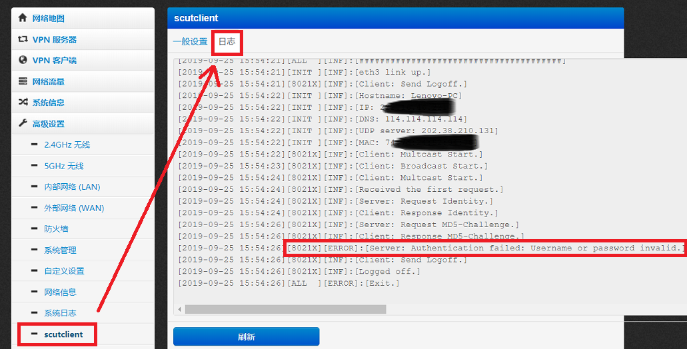
    
    下面这种日志代表你的IP或者MAC地址设置错误：  
    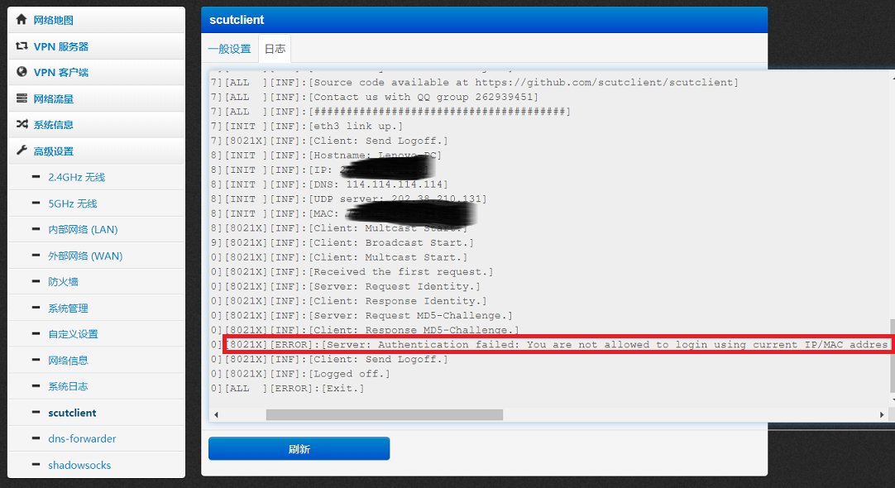

  - 如果无法进入管理界面，请将路由器[恢复出厂设置](#如何将路由器恢复出厂设置)，如果恢复出厂设置之后仍然无法进入管理界面，可能是路由器硬件损坏
  
- 我的设备搜索不到WiFi，但是别人的可以
  - 你的设备不支持5GHz WiFi，搜索不到5GHz的WiFi信号
  - 你的设备不支持路由器当前使用的无线信道，请按下图配置手动信道：

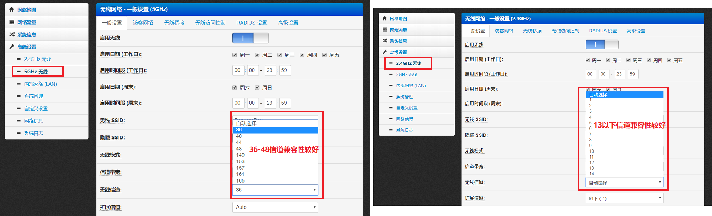

- 路由器的有线网络可以正常使用，但WiFi无法使用
  - 首先尝试将路由器硬重启：拔掉电源再插回去
  - 如果故障依旧，请将路由器[恢复出厂设置](#如何将路由器恢复出厂设置)，恢复之后立即检查WiFi是否可以被搜索到，如果不能，可能是路由器硬件损坏

<div STYLE="page-break-after: always;"></div>

## 如何将路由器恢复出厂设置

- 方法1：
  - 在开机状态下长按RESET键（对于极路由E30，RESET键在机器的底面）直到路由器自动重启，推荐采用此方法

- 方法2：
  - 在路由器管理界面里恢复出厂设置，操作顺序见下图：

    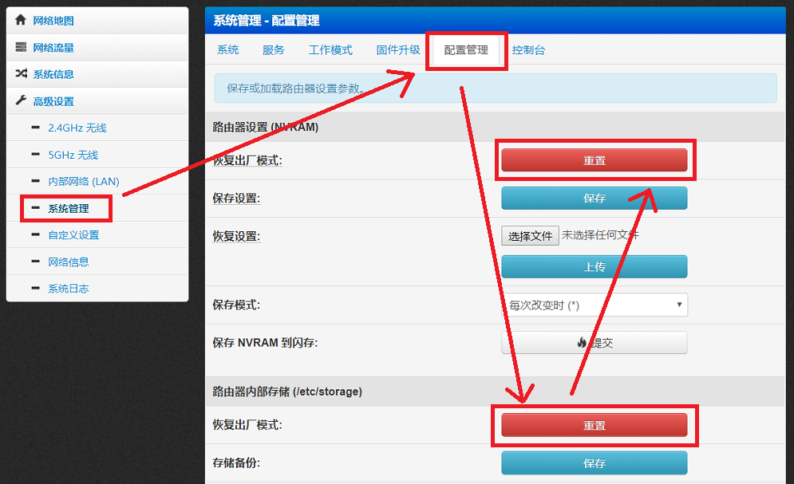

- 方法3：
  - 在breed里恢复出厂设置，分区类型选择 `Config区(公版)`
    
    

<div STYLE="page-break-after: always;"></div>

## IPv6

*此部分的内容仅适用于SCUT校园网，不保证在其它学校适用*

*此部分内容仅保证在最后更新日期前有效*

SCUT是最早支持IPv6网络的高校之一。目前，所有宿舍的有线网络，大部分实验室以及创新创业基地，教职工宿舍，家属楼等地均部署有IPv6网络，而所有的校园WiFi热点(scut-student等)都没有IPv6

SCUT的IPv6理论上不断网且不限速，相当于免费资源，但没有经过Drcom认证的端口，也就是没有登录校园网账号的网络，其IPv6不能连接外网80端口，也就是说在不开网或者夜间断网的情况下你只能访问非80端口的IPv6资源。

**截至到最后更新日期，部分宿舍有线网络的IPv6无法正常使用IPv6进行DNS查询，这种情况下必须使用IPv4 DNS**

部分宿舍的IPv6不能正常工作，请首先用电脑直接测试IPv6能否正常工作，具体步骤如下：

1. 不要用路由器，将电脑通过网线直接连接到墙壁上面的网线插口，同时断开电脑的WiFi(如果有)

2. 按下图设置Windows 10的有线网卡，自动获取IPv6地址  
   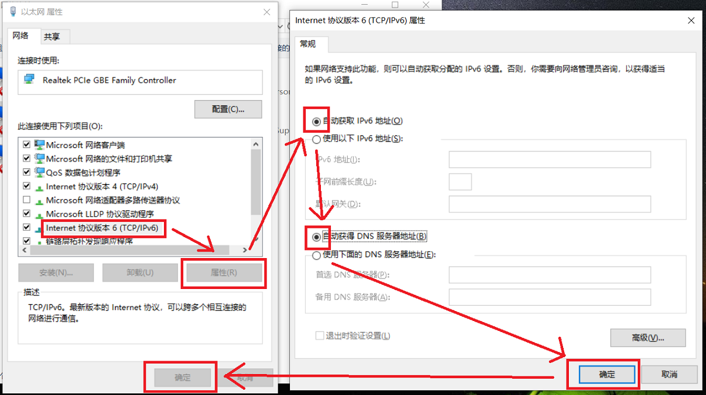

<div STYLE="page-break-after: always;"></div>

3. 等待至多5分钟，再查看有线网卡的状态信息，如果成功获取到`2XXX`开头的IPv6地址(不是`fe80`开头)，则继续第四步，否则请再继续等待3分钟，还是没有的话，请换一台电脑或者换一个插口重试一次，如果还是没有，请联系网络中心报修IPv6  
    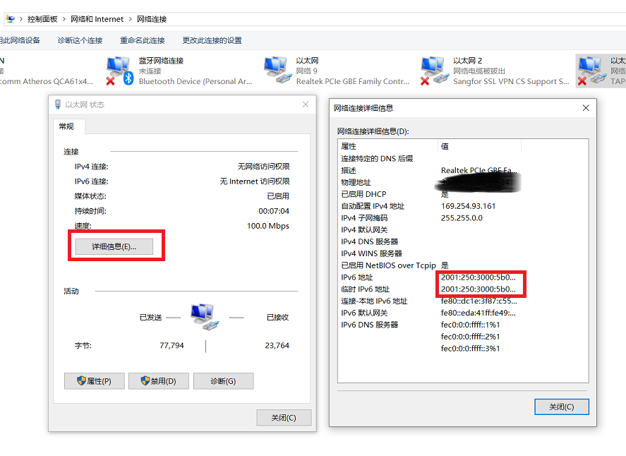

4. 成功拿到2XXX开头的IPv6地址之后，按下`Win+R`打开“运行”，输入`cmd`  
    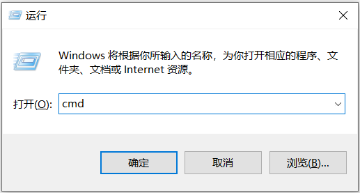

5. 在命令提示符里输入`ping 2001:da8::666`或者`ping 2001:da8:202:10::36`  
    

6. 如果以上任意一个ping正常，则说明当前网络环境下IPv6工作正常，否则请联系网络中心报修IPv6

<div STYLE="page-break-after: always;"></div>

SCUT校园网的IPv6采用SLAAC无状态协议自动配置，前缀长度是64，这是SLAAC的最大前缀长度，也就是说拿到IPv6地址的客户端理论上不能够再用SLAAC划分子网，这一点和运营商分配的IPv6有所不同（运营商分配的IPv6前缀长度一般是56或者60），这点设计的初衷应该是确保一个网口只对应一台设备，如果接入了路由器的话，想要让路由器下面的其它设备也能使用IPv6就不能够再用传统的方式。

在SCUT校园网环境下，主要有以下方法让路由器下的设备使用IPv6

  1. NAT方法(推荐)
     - 最常见的解决方案是采用跟IPv4一样的NAT方法，这样路由器底下的设备获取到的IPv6地址不再是公网地址，需要由路由器做NAT。目前Padavan的Linux 3.4内核并不支持IPv6 NAT(Linux 3.7才开始支持)，所以此功能由北邮学生开发的NAPT66实现
     - 本方法的缺点是路由器底下的设备无法获得公网IPv6地址，而且NAPT66不支持DNAT (Linux 3.7以上内核才支持IPv6的DNAT和SNAT)，如果需要DNAT可以用`socat`在应用层实现
     - scut_padavan所有固件都已经集成NAPT66，按以下步骤配置即可：
        
        1. 登入管理界面，进入`系统管理->服务`，勾选启用NAPT66  
        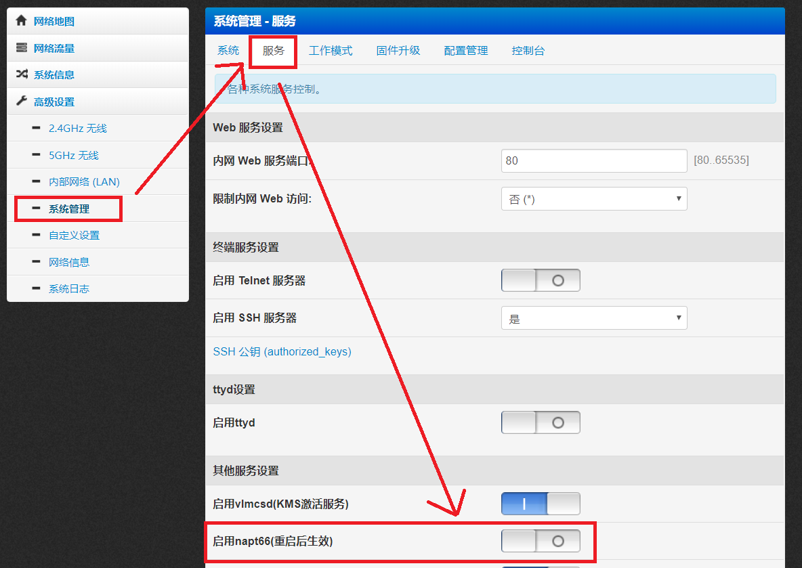
        
        <div STYLE="page-break-after: always;"></div>
        
        2. 进入`外部网络(WAN)->IPv6协议`，按照下图配置。IPv6内网设置里面的`IPv6内网地址`，如果用`dc00:101:101::1`之类的保留地址，那么大部分设备会默认用IPv6去连接双栈接入的网站；如果用`fc00:101:101::1`之类的地址，那么大部分设备会默认用IPv4去连接双栈接入的网站，推荐使用`dc00:101:101::1`  
            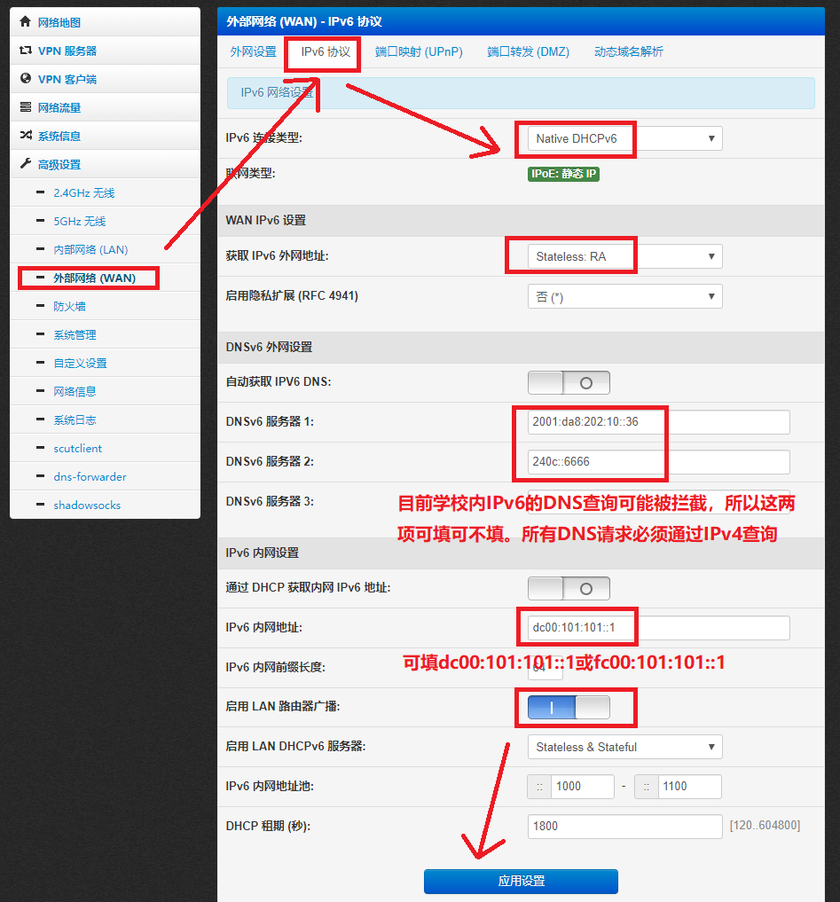
        3. **重启路由器**，等待路由器获取到2XXX开头的公网IPv6地址,可能需要一些时间...  
            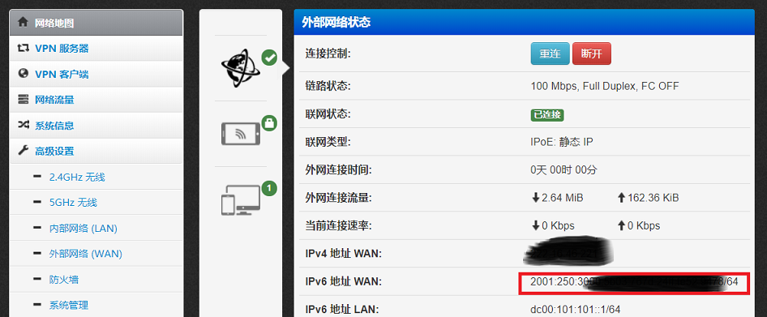
        4. 将电脑的有线/无线网卡设置成自动获取IPv6地址，一般默认就是自动获取
        5. 电脑获取到内网IPv6地址后，在电脑上尝试 `ping dc00:101:101::1` 或 `ping fc00:101:101::1`
        6. 在电脑上尝试 `ping 2001:da8::666` 或 `ping 2001:da8:202:10::36`
        7. 目前部分宿舍无法使用IPv6进行DNS查询，这种情况下要确保IPv4 DNS能正常工作
        8. 在电脑浏览器上尝试打开 `https://bt.byr.cn`
     - 对于在OpenWrt/Pandorabox(PanguBox)实现IPv6 NAT，请参考以下资料：
        - [https://www.jianshu.com/p/eb07eaac6167](https://www.jianshu.com/p/eb07eaac6167)
        - [https://blog.csdn.net/cod1ng/article/details/45421025](https://blog.csdn.net/cod1ng/article/details/45421025)

  2. 桥接方法
     - 此方法的原理是将IPv6流量绕过路由器，由第二层桥接到内网区域，这样对于IPv6而言路由器相当于完全透明
     - 此方法可以保证内网的设备获取到公网IPv6地址，但是由于分配IPv6地址需要一些时间，因此设备联网后不能够立即使用IPv6
     - 网件，华硕和一些路由器的原厂固件支持此类方法
     - 本文档不提供此方法的技术支持，有兴趣的可以参考以下资料自行研究：
       - [http://koolshare.cn/forum.php?mod=viewthread&tid=46415](http://koolshare.cn/forum.php?mod=viewthread&tid=46415)
       - [https://github.com/cvmiller/v6brouter](https://github.com/cvmiller/v6brouter)
       - [https://www.right.com.cn/forum/thread-322534-1-1.html](https://www.right.com.cn/forum/thread-322534-1-1.html)
       - [https://www.jianshu.com/p/ed34cbf3b90c](https://www.jianshu.com/p/ed34cbf3b90c)
  3. 6relay方案
     - 极路由原厂固件和一些比较陈旧的教程会采用此方案，目前该方案已被淘汰

IPv6注意事项
  1. 对于使用IPv6的PT用户，请务必使用https tracker服务器，否则本科生夜间断网后无法连接tracker服务器

      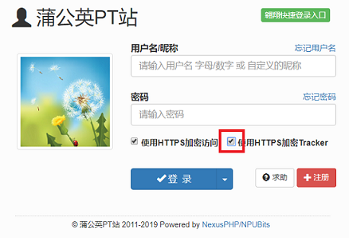

  2. NAT6后的内网无法使用transmission，而utorrent, qbittorrent和deluge等客户端可以正常工作
  3. 目前SCUT的校内IPv6不允许外部传入连接，因此无法从学校外部的IPv6网络连入学校内的IPv6设备

<div STYLE="page-break-after: always;"></div>

## 本固件的其它内置功能

- vlmcsd, 用于自动激活Windows10和Office(VOL版)系列全家桶

- 插件的使用说明请参考以下链接：
  - [https://www.jianshu.com/p/cb51fb0fb2ac](https://www.jianshu.com/p/cb51fb0fb2ac)

Padavan不能像OpenWrt一样随意安装软件，除非在可写的外置存储安装Entware环境(需要外挂U盘或SD卡)。除此之外所有的内置插件都是与固件一起编译出来的，想要增加额外的功能必须修改源码并重新编译。

## 如何在其它网络环境下使用本固件

*其它网络环境指的是别的学校的校园网，或者自己家里，实验室等不需要进行scutclient认证的网络环境*

*本部分内容仅适用于scut_padavan固件*

首先要确定该网络环境的上网方式，一般是以下三种之一：

- 静态IP地址 (需要手动填写IP地址、网关、掩码的网络)
- 动态IP地址 (插上网线就能直接用的，学校实验室一般是这种，光猫拨号的家用宽带也是此类)
- PPPoE (需要账号密码登录，很多家用宽带是此类，部分学校的校园网也是)

登入路由器管理界面，首先关闭scutclient认证：

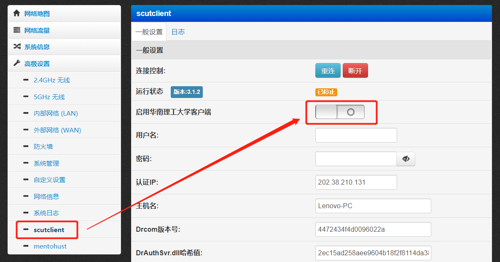

<div STYLE="page-break-after: always;"></div>

然后到`外部网络(WAN)`选择正确的联网类型：

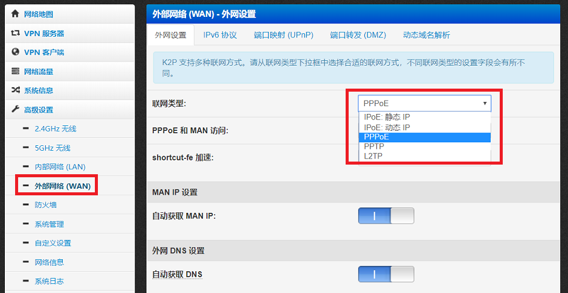

对于动态IP地址(DHCP)，无需进行其它配置；对于静态IP地址，需要设置正确的IP地址、子网掩码、网关以及DNS服务器；对于PPPoE，需要设置PPPoE的用户名和密码。

对于其它学校的校园网，一般情况下都需要进行认证，scut_padavan已经内置了mentohust, minieap, njit-client和dogcom这四种常见的校园网通用认证插件，但是都没有webui界面，只能在命令行里操作，具体使用方法请自行研究。

scut_padavan还内置了支持https的curl，可以进行portal认证。

<div STYLE="page-break-after: always;"></div>

## 如何重刷或者刷入其它固件

1. 在breed/pb-boot里刷入固件 **(推荐)**
   - 此方法适用于任何已经刷好了breed或者pb-boot的路由器
   - 将路由器断电，按住RESET键后再上电，等待10秒后松开RESET键
   - 将电脑和路由器任一LAN口连接起来，电脑有线网卡配置成自动获取IP地址
   - 用浏览器访问`192.168.1.1`,即可打开breed/pb-boot的操作界面
   - 对于breed，请按照下图选择固件上传并刷入：
    
    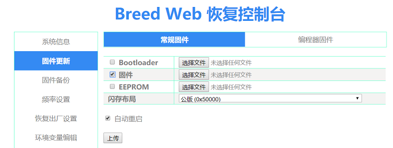
   
   - 对于pb-boot，直接选择固件上传即可：
    
    

2. 在Padavan管理界面刷入固件
   - 此方法只能刷入同类型的Padavan固件
   - 在Padavan管理界面，进入以下界面，选择固件刷入：  
    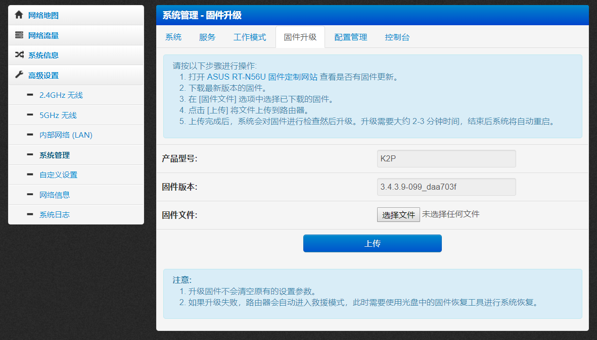

3. 在控制台终端刷入固件
   - 用Winscp或其它工具将要刷入的固件上传到路由器的`/tmp`目录下
   - [登入控制台终端](#如何进入路由器的控制台终端)，可以通过ssh, telnet或者ttyd
   - 运行以下命令刷入固件：
    ```sh
    mtd_write -r write <固件文件路径> Firmware_Stub
    #例如：mtd_write -r write /tmp/HC5861B.trx Firmware_Stub
    ```

**注意：由于Padavan固件的配置保存在单独的分区，所以一般情况下刷机后所有配置都保持不变，如果需要清空配置，需要单独执行恢复出厂设置的操作**

<div STYLE="page-break-after: always;"></div>

## 如何获取固件更新

scut_padavan固件完全开源，有以下三种方式获取固件：
  
- 从[Github Releases](https://github.com/hanwckf/rt-n56u/releases)下载不定期发布的固件
- 从[此链接](https://www.jianshu.com/p/d76a63a12eae)获得不定期更新的固件和更新日志，此处的更新频率高于Github Releases
- 从源码构建最新固件，请参考[README.md](https://github.com/hanwckf/rt-n56u/blob/master/README.md#编译说明)的编译说明

<div STYLE="page-break-after: always;"></div>

## 如何备份EEPROM, EEPROM丢失了怎么办

在MTK的无线方案中，EEPROM指的是保存有MAC地址和无线校准信息的一段特殊数据，类似于高通平台的ART。每台机器的EEPROM都不相同。正常操作不会导致EEPROM被擦除，而操作不当可能导致EEPROM丢失，此时MAC地址和WiFi信号都不正常。

如果EEPROM丢失，必须重新刷入正确的EEPROM，最好在刷机前备份好自己的EEPROM以防万一。

备份EEPROM的方法有以下两种：

1. 在breed里备份，见下图 **(推荐)**
    
    

2. 在控制台终端里备份
   1. [登入控制台终端](#如何进入路由器的控制台终端)，运行以下命令：
    ```bash
    cat /proc/mtd
    ```
   2. 观察输出结果，找到`Factory`所在的分区，例如以下输出对应`mtd2`
    ```bash
    dev:    size   erasesize  name
    mtd0: 00030000 00010000 "Bootloader"
    mtd1: 00010000 00010000 "Config"
    mtd2: 00010000 00010000 "Factory"
    mtd3: 001355f0 00010000 "Kernel"
    mtd4: 00dfaa10 00010000 "RootFS"
    mtd5: 00080000 00010000 "Storage"
    mtd6: 00f30000 00010000 "Firmware_Stub"
    ```

   3. 用`dd`将`mtdblock2`读出到`/tmp`
    ```bash
    dd if=/dev/mtdblock2 of=/tmp/eeprom.bin
    ```

   4. 使用tftp或者scp将`/tmp/eeprom.bin`下载到电脑即可

要重新刷入EEPROM，推荐直接在breed里操作。进入breed，按下图勾选EEPROM刷入即可：

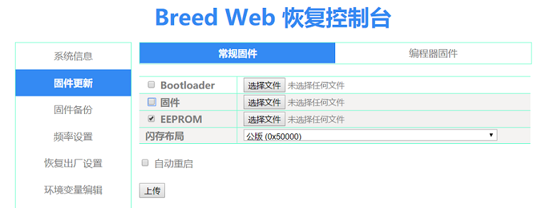

如果你没有备份EEPROM但是不慎丢失EEPROM，可以在搜索引擎搜索"路由器型号+EEPROM"看看有没有网友上传的EEPROM备份。

<div STYLE="page-break-after: always;"></div>

## 如何进入路由器的控制台终端

可以使用以下4种方式进入控制台终端

- ssh
- telnet
- ttyd
- UART

scut_padavan默认开启ssh并关闭telnet，默认的用户名和密码都是`admin`

需要启用ttyd请看下图，启用ttyd后可以用 `http://<路由器IP>:7681` 或 `http://my.router:7681` 访问webshell

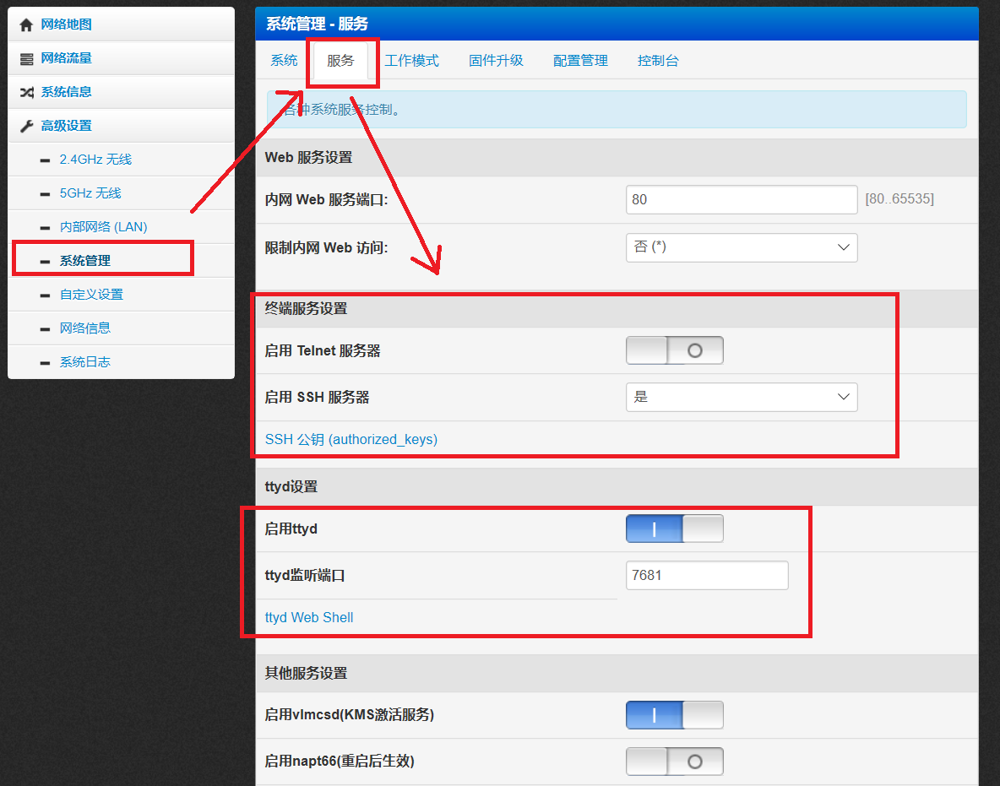

极路由E30的scut_padavan串口波特率为`57600`，TTL焊盘位于FLASH的右上方，拆开机器后容易看到。

**注意：Padavan固件是完全只读的，可写目录除了 `/etc/storage/` 以外全部都是tmpfs，掉电后会丢失所有内容，如果需要在路由器里存放数据，必须保存在 `/etc/storage/` 目录，而且保存后必须执行 `mtd_storage.sh save` 才能将修改写入到FLASH中！**

<div STYLE="page-break-after: always;"></div>

## 如何选择其它路由器

*此部分内容仅保证在最后更新日期前有参考价值；路由器推荐的考虑因素包括硬件规格、第三方固件的支持度以及刷机救砖的难易度*

**新手注意：千万不要购买没有刷好breed的路由器！因为大部分路由器从原厂固件刷入breed操作繁琐，新手操作很可能会导致路由器变砖，必须让卖家帮忙刷好breed才可购买！**

在校园网内使用路由器，必须由路由器代替学校的上网客户端进行认证，还要骗过上级网关的检测机制（如HTTP UA检查等。SCUT不存在这种检测，某些学校有），**所以路由器的必要条件是能刷够入原厂固件以外的第三方固件，例如OpenWrt或者本项目的Padavan，绝大多数普通路由器都不能满足这一条件。**

想要使用原汁原味的OpenWrt固件，建议选择高通平台的路由器，因为高通的开源无线驱动ath9k/ath10k工作表现良好。

**不推荐购买AR7241+AR9287,单AR9331/9341这些过时的单频路由器（如tp-link 841n,941n等被某些校园网路由器奸商卖到上百元高价的路由器），推荐从QCA9558/QCA9563+QCA988X起步，也可以考虑IPQ401X系列，但是价格较贵。**

使用ath10k开源驱动，路由器最好要有128M或以上的RAM；如果使用闭源的qcawifi驱动，则64M内存一般足够（如斐讯K2T等64M内存的路由器）。

关于在OpenWrt使用scutclient进行校园网认证，请看[此处](https://github.com/scutclient/scutclient)，你也可以加入[华工路由器群](https://github.com/scutclient/scutclient#contact-us)了解更多信息，**OpenWrt不在本文档的支持范围之内。**

截至最后更新日期，推荐的高通方案路由器有：
- SBR-AC1750 (QCA9558+QCA9880)
- 华硕AC58U (IPQ401x)
- 华硕ACRH17 (IPQ401x+QCA9984)
- DW33D (QCA9558+QCA9880，硬件设计缺陷，随时有变砖风险，详情请看[此处](https://www.right.com.cn/forum/thread-361850-1-1.html))
- 斐讯K2T (QCA9563+QCA9886，只有64M内存，最好不要用ath10k驱动的OpenWrt，或硬改到128M)
- 360 C301 (AR9344+QCA9882)

想要使用Padavan固件，只能选择MT7620/7621/7628的路由器，并且无线芯片必须是MT7610/7612/7603/7615之一，否则没有无线驱动支持。

scut_padavan在源码中集成了scutclient，并且在[Releases](https://github.com/hanwckf/rt-n56u/releases)中发布的大部分机型已将scutclient编译进去，绝大多数SCUT的同学可免于折腾直接使用。

**不推荐购买过时的单7620/7628的单频路由器（如极路由1S等），至少应选择支持5GHz WiFi的路由。**

截至最后更新日期，推荐的MTK方案路由器有：
- DIR-882 (MT7621+MT7615+MT7615)
- DIR-878 (MT7621+MT7615+MT7615，与DIR-882几乎一样)
- 斐讯K2P (MT7621+MT7615D，**一代神器**，已经炒到200元，以前只要100元)
- NEWIFI3 (MT7621+MT7603+MT7612，WiFi可能很差，存世量大，玩家多，但不折腾的同学不要选择)
- 斐讯K2 (MT7620+MT7612，上代神器)
- 极路由E30/HC5861B (MT7628+MT7612)

MTK系列的路由器还可以刷同样采用私有无线驱动的PandoraBox(PanguBox)或高恪固件，这两个固件都不开放源代码，但是PandoraBox提供SDK，可以自己构建ipk包（前提是你没碰到它的bug）。同时PandoraBox还支持ar71xx/ipq401x/ipq806x等高通方案的路由器，里面用的是闭源的qcawifi无线驱动。

MT7620/MT7628片内集成百兆交换机、单核580MHz MIPS 24kc处理器和2x2 2.4GHz WiFi模块，两者的区别在于MT7628去掉了MT7620的HWNAT，但增强了2.4GHz WiFi的抗干扰能力。  
MT7621片内集成千兆交换机以及双核四线程的880MHz MIPS 1004kc处理器，没有无线模块，因此MT7621方案的路由器需要外挂一个2.4GHz的无线芯片，一般会选用MT7603，有些高端产品会选用MT7615。显然MT7621的处理器远强于MT7620/7628，如果你在宿舍需要挂pt的话，推荐选择MT7621，或者考虑下面的软路由方案。  
MT7615是MTK新一代的无线芯片，性能远超MT7612和MT7603，价格也贵一些。

MTK的无线方案在原版OpenWrt下采用mt76开源无线驱动，其性能和稳定性都弱于原厂私有驱动，当然随着代码的不断完善，相信mt76开源驱动的bug会越来越少。

Marvell方案的路由器比较冷门且价格较高，但是对OpenWrt支持良好，例如思科WRT1900ACS系列。

如果你有一块SBC（树莓派及其它各种国产pi）或ARM/ARM64盒子（斐讯N1,贝壳云,猫盘等等,常见的方案有s905/s912,RK3328/RK3368等等），可以用它作为OpenWrt软路由，再搭配一个MT7620/MT7621路由器做为VLAN交换机，此部分的参考资料会尽快更新上来。  
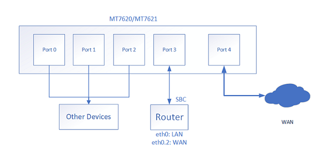

不推荐任何螃蟹方案的路由，因为几乎没有开源支持。  
**至于垃圾bcm：**


<div STYLE="page-break-after: always;"></div>

## 其它关于校园网的信息
请参考：[https://www.jianshu.com/p/94e17b6fa256](https://www.jianshu.com/p/94e17b6fa256)
