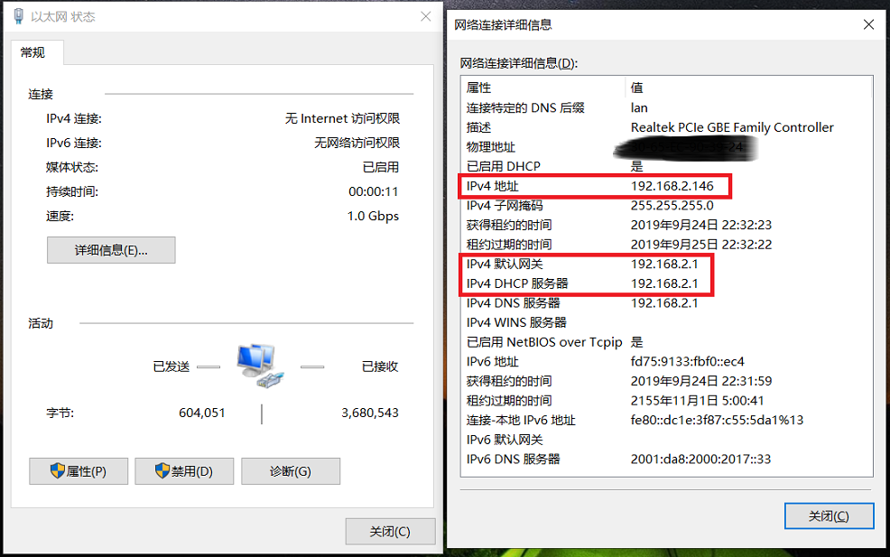
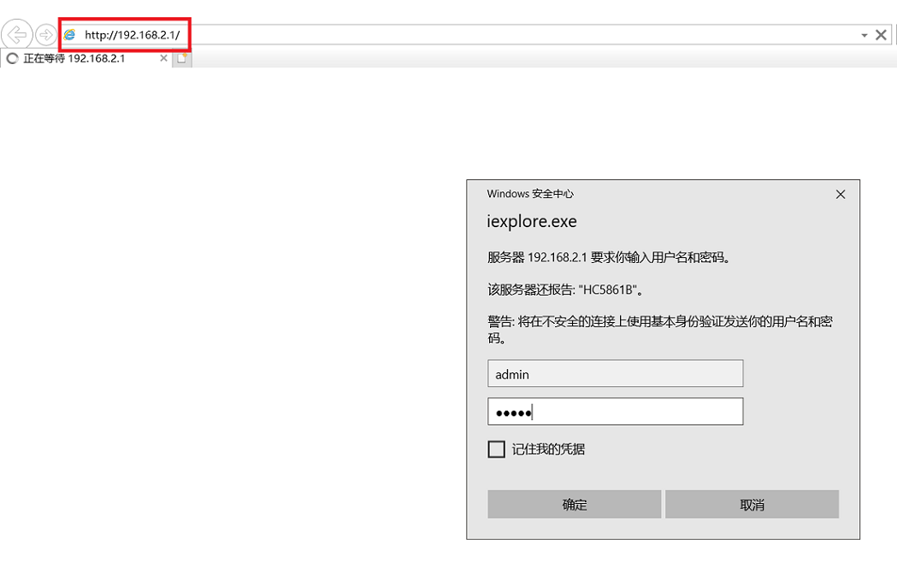
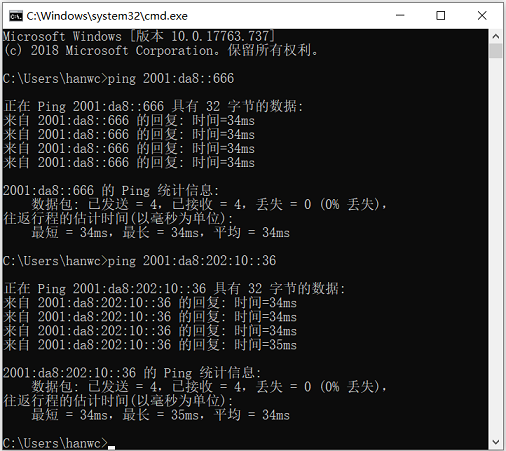
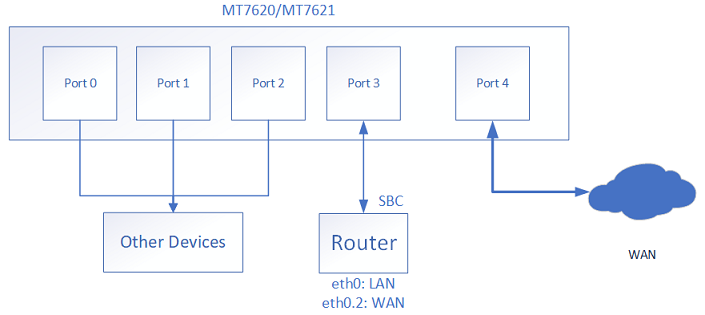

# scut_padavan使用指南 <!-- omit in toc -->

*最后更新日期：2019年9月24日*

***
本作品采用[知识共享署名-非商业性使用-相同方式共享 4.0 国际许可协议](https://creativecommons.org/licenses/by-nc-sa/4.0/)进行许可。


***
## FAQ <!-- omit in toc -->
- 本固件的WiFi的默认名称和密码是？
  - 对于极路由E30/HC5861B/Enjoy1200
    - 默认SSID：`HC5861B_XXXX`和`HC5861B_5G_XXXX`，默认密码都是`1234567890`
  - 其它机器的默认SSID格式`<机器型号>_<MAC后4位>`以及`<机器型号>_5G_<MAC后4位>`，默认密码都是`1234567890`
- 本固件的管理界面的默认IP地址是？
  - 默认IP地址：`192.168.2.1`，也可以使用域名 `my.router`
- 本固件的管理界面的默认登录账号密码是？
  - 默认用户名：`admin`，默认密码：`admin`，ssh/telnet用户名密码同上
- 我更换了宿舍或者重置了校园网的账号密码，需要在路由器上怎么做？
  - 重新做一次快速配置即可，见[第2节](#快速配置指南)
- 如何重新设置WiFi密码？
  - 见[第2节](#快速配置指南)末尾
- 如何进入breed？
  - 电脑有线网卡配置成自动获取IP地址，然后连到路由器的任意网口，路由器先按住RESET按键后再上电，等待10秒后松开RESET键，然后在电脑浏览器里访问 `192.168.1.1`

<div STYLE="page-break-after: always;"></div>

## 目录 <!-- omit in toc --> 
1. [介绍](#介绍)
2. [快速配置指南](#快速配置指南)
3. [简单故障排查](#简单故障排查)
4. [如何将路由器恢复出厂设置](#如何将路由器恢复出厂设置)
5. [IPv6](#ipv6)
6. [本固件的其它内置功能](#本固件的其它内置功能)
7. [如何在其它网络环境下使用本路由器](#如何在其它网络环境下使用本路由器)
8. [如何重刷或者刷入其它固件](#如何重刷或者刷入其它固件)
9. [如何获取固件更新](#如何获取固件更新)
10. [如何备份EEPROM, EEPROM丢失了怎么办](#如何备份eeprom-eeprom丢失了怎么办)
11. [如何进入路由器的控制台终端](#如何进入路由器的控制台终端)
12. [如何选择其它路由器](#如何选择其它路由器)
13. [其它关于校园网的信息](#其它关于校园网的信息)

<div STYLE="page-break-after: always;"></div>

## 介绍

本文档使用的scut_padavan为完全开源的路由器固件，**与OpenWrt没有任何关系**，是来自俄罗斯的Padavan项目的一个Fork，民间俗称老毛子，仅适用于MT7620/7621/7628平台的路由器。

由于MTK系列的无线方案在开源mt76驱动下的性能和稳定性不及原厂驱动，因此很多MTK路由器玩家会选择PandoraBox(PanguBox),高恪或Padavan等使用MTK私有无线驱动的固件。

*注1：高通平台的开源无线驱动ath10k/ath9k支持良好，如果需要OpenWrt的话推荐选择高通平台的路由器*

*注2：PandoraBox(PanguBox)以及高恪同样使用mtk的私有无线驱动，但固件本身不开源*

scut_padavan最新的源代码在以下两个仓库里分发：
- [https://github.com/hanwckf/rt-n56u.git](https://github.com/hanwckf/rt-n56u.git)
- [https://gitee.com/hanwckf/rt-n56u.git](https://gitee.com/hanwckf/rt-n56u.git)

固件里使用的scutclient为原项目的一个Fork，其源码可以在以下仓库里找到：

- [https://github.com/hanwckf/scutclient.git](https://github.com/hanwckf/scutclient.git)

目前scut_padavan中使用的scutclient源码版本为v3.0或v3.1.2

极路由E30/HC5861B/Enjoy1200(以下简称极路由E30)是本项目支持的机型之一，目前本文档使用的参考机型为此款路由，如果你使用的是scut_padavan项目支持的其它路由器，也可以参考本文档进行配置。

极路由E30的硬件配置如下：
- CPU/2.4GHz WiFi: MT7628A (iPA+iLNA)
- RAM: 128M
- FLASH: 16M
- 5GHz WiFi: MT7612E (iPA+iLNA)

截至最后更新日期，此款已经停产的路由器可以在二手市场以较低的价格(40-70元不等)购买到，是同价位中支持5GHz WiFi最便宜的路由器之一，其它同类机器有小米路由Mini和斐讯K2(40-80元不等)等，也是支持5GHz WiFi的低价路由器。你也可以选择scut_padavan项目支持的其它路由器，例如DIR-882, K2P等采用MT7615+MT7621方案的路由器(200元以上,性能强大)，或者是NEWIFI3等MT7621矿渣路由器(千兆,100元全新,WiFi信号可能很差)，只要刷入scut_padavan即可按照本文档的后续内容进行配置。

**新手注意：千万不要购买没有刷好breed的路由器！因为刷入breed可能会导致路由器变砖，必须让卖家帮忙刷好breed后再按照本文档说明进行配置，或者可以一步到位让卖家帮忙刷好scut_padavan，只需将对应机器的固件发给卖家即可，想要获取最新固件请看[这里](#如何获取固件更新)的内容。**

**一些出售所谓校园网专用路由器的商家，把成本更低的机器(单7620/7628, AR7241+AR9287或AR9341, 不支持5GHz)卖到上百元的高价，而读完这篇文档后，你完全可以自主选择性价比更高的路由器，同时也具备了一个玩家所需要的基础知识。**

对于只刷好breed/pb-boot但是没有刷入scut_padavan的路由器，请参考[这里](#如何重刷或者刷入其它固件)的内容在breed/pb-boot中刷入本固件。

有关于scut_padavan的其它问题，可以在[Github issues](https://github.com/hanwckf/rt-n56u/issues)提问，或者发送邮件到 `hanwckf@vip.qq.com`

<div STYLE="page-break-after: always;"></div>

## 快速配置指南

对于已经刷好了scut_padavan固件的路由器，普通用户仅需执行此快速配置即可

    准备工作：
      - 正常工作的网线，最好有2条，1条也可以

1. 记录以下必要信息，可以去网上营业厅查看或者圈存机查询，也可以用电脑里保存的旧信息
   
   >- 校园网登录用户名和密码，用户名一般是学号，密码默认是身份证后8位
   >- 网络中心分配的IP地址，网关和子网掩码，可以去网上营业厅或者圈存机查看
   >- 开网时提交的MAC地址，可以去网上营业厅或者圈存机查看

2. 将路由器接好电源，通电

3. **如果你拿到的路由器是别人用过的，请通电两分钟后长按RESET键直到路由器自动重启，这样做的目的是恢复出厂设置**

4. 对于极路由E30，请按下图的说明，将墙壁上的网线插孔与路由器的WAN口连接起来，切勿插错端口

5. 把电脑与路由器剩下的任意一个接口连接起来
   
   如果你的电脑没有有线网卡或者你只有一根网线，可以使用WiFi连接本路由器。在路由器启动完成之后会出现两个热点，对于极路由E30，WiFi名称默认是`HC5861B_XXXX`和`HC5861B_5G_XXXX`，WiFi默认密码都是`1234567890`
   
6. 按下`Win+R`，输入`control`，确定，打开控制面板


<div STYLE="page-break-after: always;"></div>

7. 在控制面板中，切换查看方式为`类别`，然后点击`查看网络状态和任务`
    


8. 点击`更改适配器设置`
    


<div STYLE="page-break-after: always;"></div>

9. 把有线网卡的IP地址设置成自动获取，**如果你采用Wifi连接路由器则无需这一步操作**

    找到电脑的有线网卡，一般情况下它的名字为`以太网`，并且很有可能带有`Realtek`之类的字符，如果你插好了网线并且路由器是开启状态的话，此网卡的图标上不会带有×号。右键点击你的有线网卡，选择`属性`

    

    先点一下`Internet协议版本4 (TCP/IPv4)`，再点一下`属性`，选择自动获取IP地址后确定保存

    

<div STYLE="page-break-after: always;"></div>

10. 查看有线或无线网卡的状态信息，确保电脑已经获取到了192.168.2.X的IP地址。找到你的有线网卡或无线网卡，`双击它`。一般情况下有线网卡的名字是`以太网`，无线网卡的名字是`WLAN`
    


11. 点击`详细信息`，检查IP地址是否为192.168.2.X
    


<div STYLE="page-break-after: always;"></div>

12. 打开浏览器，在地址栏输入`192.168.2.1`，按回车，弹出认证界面，输入用户名`admin`和默认密码`admin`登入管理界面



<div STYLE="page-break-after: always;"></div>

13. 在管理界面内，首先按照下图配置WAN口参数，填写完成之后点击**应用设置**，数秒后会自动刷新。如果没有自动刷新，请手动点一下浏览器的刷新键


<div STYLE="page-break-after: always;"></div>

14. 在管理界面内，按照下图配置scutclient，填写完成之后点击**应用设置**

15. 查看scutclient中的日志，没有出现Failure之类的输出说明认证成功，此时电脑应该可以正常上网了

16. 按下图配置2.4GHz/5GHz WiFi的SSID和密码，**对于大多数设备，建议使用5GHz WiFi**


17. 快速配置完成

<div STYLE="page-break-after: always;"></div>

## 简单故障排查

- 平时可以正常使用，突然无法上网，同时WiFi或者有线连上去之后浏览器会弹出认证页面
  - 首先请检查校园网是否欠费
  - 然后尝试将路由器硬重启：拔掉电源再插回去
  - 如果重启完成后仍然出现本问题，请断开路由器，将电脑和墙壁上的网线插口直接相连，然后配置有线网卡为静态地址并填入开网时获取的信息(IP,掩码,网关)，再使用学校官方客户端进行登录测试。如果学校官方的客户端也无法登录，请致电网络中心XXXXXXXX报修。如果学校客户端可以正常使用，请将路由器按原样插回，然后登入路由器管理界面，按下图找到scutclient的日志

- 平时可以正常使用，突然无法上网，同时不弹出认证页面
  - 首先尝试将路由器硬重启：拔掉电源再插回去
  - 如果故障依旧，请尝试登入路由器的管理界面，如果无法进入管理界面，请将路由器[恢复出厂设置](#如何将路由器恢复出厂设置)
  - 如果可以进入管理界面，请按下图找到scutclient的日志
  - 如果恢复出厂设置之后仍然无法进入管理界面，可能是路由器硬件损坏
  
- 我的设备搜索不到WiFi，但是别人的可以
  - 你的设备不支持5Ghz WiFi，搜索不到5Ghz的WiFi信号
  - 你的设备不支持路由器当前使用的信道，请在管理界面按下图配置手动信道：

- 路由器的LAN有线网络可以正常使用，WiFi无法使用(搜索不到WiFi名称)
  - 首先尝试将路由器硬重启：拔掉电源再插回去
  - 如果故障依旧，请将路由器[恢复出厂设置](#如何将路由器恢复出厂设置)，恢复之后立即检查WiFi是否可以被搜索到，如果不能，可能是路由器硬件损坏

<div STYLE="page-break-after: always;"></div>

## 如何将路由器恢复出厂设置

- 方法1：
  - 在开机状态下长按RESET按键直到路由器自动重启，推荐采用此方法。

- 方法2：
  - 在路由器管理界面里恢复出厂设置，操作顺序见下图：

    

- 方法3：
  - 在breed里恢复出厂设置，分区类型选择 `Config区(公版)`：
    
    

<div STYLE="page-break-after: always;"></div>

## IPv6

*此部分的内容仅适用于SCUT校园网，不保证在其它学校适用*

*此部分内容仅保证在最后更新日期前有效*

SCUT是最早支持IPv6网络的高校之一。目前，所有宿舍的有线网络，大部分实验室以及创新创业基地，教职工宿舍，家属楼等地均部署有IPv6网络，而所有的校园WiFi热点(scut-student等)都没有IPv6

没有经过Drcom认证的端口，也就是没有登录校园网账号的网络，不能连接外网的80端口，也就是说在不开网或者夜间断网的情况下你仍然可以使用IPv6访问非80端口的IPv6资源。

**截至到最后更新日期，部分宿舍有线网络的IPv6无法正常使用IPv6 DNS查询，这种情况下必须使用IPv4 DNS**

部分宿舍的IPv6不能正常工作，请首先用电脑直接测试IPv6能否正常工作，具体步骤如下：

1. 不要用路由器，将电脑通过网线直接连接到墙壁上面的网线插口，同时断开电脑的WiFi(如果有)

2. 按下图设置Windows 10的有线网卡，自动获取IPv6地址
   

<div STYLE="page-break-after: always;"></div>

3. 等待至多5分钟，再查看有线网卡的状态信息，如果成功获取到2XXX开头的IPv6地址，则继续第四步，否则请再继续等待3分钟，假如还是没有的话，请换一台电脑或者换一个插口重试一次，如果还是没有，请联系网络中心报修IPv6
    

4. 成功拿到2XXX开头的IPv6地址之后，按下Win+R打开“运行”，输入cmd
    

5. 在命令提示符里输入`ping 2001:da8::666`或者`ping 2001:da8:202:10::36`
    

6. 如果以上任意一个ping正常，则说明当前网络环境下IPv6工作正常，否则请联系网络中心报修IPv6

SCUT校园网的IPv6采用SLAAC无状态协议自动配置，前缀长度是64，这是SLAAC的最大前缀长度，也就是说拿到IPv6地址的客户端理论上不能够再划分子网，这一点和运营商分配的IPv6有所不同（运营商分配的IPv6前缀长度一般是56或者60，所以还能够再划分子网），这点设计的初衷应该是确保一个网口只对应一台设备，如果接入了路由器的话，想要让路由器下面的其它设备也能使用IPv6就不能够再用传统的方式。

在SCUT校园网环境下，主要有以下3种方式实现让路由器下的设备使用IPv6

  1. NAT方法(推荐)
     - 最常见的解决方案是采用跟IPv4一样的NAT方法，这样路由器底下的设备获取到的IPv6地址不再是公网地址，需要由路由器做NAT。目前Padavan的Linux 3.4内核并不支持IPv6 NAT(Linux 3.7才开始支持)，所以此功能由北邮学生开发的NAPT66实现。
     - 本方法的缺点是路由器底下的设备无法获得公网IPv6地址，而且NAPT66不支持DNAT (Linux 3.7以上内核才支持IPv6的DNAT和SNAT)，如果需要DNAT可以用`socat`在应用层实现。
     - scut_padavan所有固件都已经集成NAPT66，按以下步骤配置即可：
        1. aa
        2. bb
        3. cc
        4. dd
     - 对于在OpenWrt/Pandorabox(PanguBox)实现IPv6 NAT，请参考以下资料：
        1. aa
        2. bb

  2. 桥接方法
     - 此方法的原理是将IPv6流量绕过路由器，由第二层桥接到内网区域，这样对于IPv6而言路由器相当于完全透明，路由器本身也无法获取到IPv6地址。
     - 此方法可以保证内网的设备获取到公网IPv6地址，但是由于分配IPv6地址需要一些时间，因此设备联网后不能够立即使用IPv6
     - 本文档不提供此方法的技术支持，有兴趣的可以参考以下资料自行研究：
       1. aa
       2. bb
       3. cc
  3. 6relay方案
     - 极路由原厂固件和一些比较陈旧的教程会采用此方案，目前该方案已被淘汰。

IPv6注意事项
  1. 对于使用IPv6的PT用户，请务必使用https tracker服务器，否则本科生夜间断网后无法连接tracker服务器

      

      

  2. NAT6后的内网无法使用transmission，而utorrent, qbittorrent和deluge等客户端可以正常工作
  3. 目前SCUT的校内IPv6不允许外部传入连接，因此无法从学校外部的IPv6网络连入学校内的IPv6设备

<div STYLE="page-break-after: always;"></div>

## 本固件的其它内置功能

- vlmcsd, 用于自动激活Windows10和Office(VOL版)系列全家桶

- 插件的使用说明请参考以下链接：
  - [https://www.jianshu.com/p/cb51fb0fb2ac](https://www.jianshu.com/p/cb51fb0fb2ac)

## 如何在其它网络环境下使用本路由器

*其它网络环境指的是别的学校的校园网，或者自己家里，实验室等不需要进行scutclient认证的网络环境*

*本部分内容仅适用于scut_padavan固件*

首先要确定该网络环境的上网方式，一般是以下三种之一：

- 静态IP地址 (需要手动填写IP地址,网关,掩码的网络)
- 动态IP地址 (插上网线就能直接用的，学校实验室一般是这种，光猫拨号的家用宽带也是此类)
- PPPoE (需要账号密码登录，很多家用宽带是此类，部分学校的校园网也是)

登入路由器管理界面，首先关闭scutclient认证：

然后到外部网络(WAN)配置正确的参数：

对于其它学校的校园网，一般情况下都需要进行认证，scut_padavan已经内置了mentohust, minieap, njit-client和dogcom这四种常见的校园网通用认证插件，但是都没有webui界面，只能在命令行里操作，具体使用方法请自行研究。

scut_padavan还内置了支持https的curl，可以进行portal认证。

<div STYLE="page-break-after: always;"></div>

## 如何重刷或者刷入其它固件

1. 在breed/pb-boot里刷入固件 **(推荐)**
   - 此方法适用于任何已经刷好了breed或者pb-boot的路由器
   - 将路由器断电，按住RESET后再上电，等待10秒后松开RESET按键
   - 将电脑和路由器任一LAN口连接起来，电脑有线网卡配置成自动获取IP地址
   - 用浏览器访问`192.168.1.1`,即可打开breed/pb-boot的操作界面
   - 对于breed，请按照下图选择固件上传并刷入：
    
    
   
   - 对于pb-boot，直接选择固件上传即可：
    
    

2. 在Padavan管理界面刷入固件
   - 此方法只能刷入同类型的Padavan固件
   - 在Padavan管理界面，进入以下界面，选择固件刷入：
    

3. 在Padavan的控制台终端里刷入固件
   - 用Winscp或其它工具将要刷入的固件上传到路由器的`/tmp`目录下
   - [登入控制台终端](#如何进入路由器的控制台终端)，可以通过ssh,telnet或者ttyd
   - 运行以下命令刷入固件：
    ```sh
    mtd_write -r write <固件文件路径> Firmware_Stub
    #例如：mtd_write -r write /tmp/HC5861B.trx Firmware_Stub
    ```

**注意：由于Padavan固件的配置保存在单独的分区，所以一般情况下刷机后所有配置都保持不变，如果需要清空配置，需要单独执行恢复出厂设置的操作**

<div STYLE="page-break-after: always;"></div>

## 如何获取固件更新

scut_padavan固件完全开源，有以下三种方式获取固件：
  
- 从[Github Releases](https://github.com/hanwckf/rt-n56u/releases)下载不定期发布的固件
- 从[此链接](https://www.jianshu.com/p/d76a63a12eae)获得不定期更新的固件和更新日志，此处的更新频率高于Github Releases
- 从源码构建最新固件，请参考[README.md](https://github.com/hanwckf/rt-n56u/blob/master/README.md#编译说明)的编译说明

<div STYLE="page-break-after: always;"></div>

## 如何备份EEPROM, EEPROM丢失了怎么办

在MTK的无线方案中，EEPROM指的是保存有MAC地址和无线校准信息的一段特殊数据，类似于高通平台的ART。每台机器的EEPROM都不相同。

正常操作不会导致EEPROM被擦除，而操作不当可能导致EEPROM丢失，此时MAC地址和WiFi信号都不正常。如果EEPROM丢失，必须重新刷入正确的EEPROM，最好在刷机前备份好自己的EEPROM以防万一。

备份EEPROM的方法有以下两种：

1. 在breed里备份 **(推荐)**

    按下图备份EEPROM即可
    
    

2. 在Padavan控制台终端里备份
   1. [登入控制台终端](#如何进入路由器的控制台终端)，运行以下命令：
    ```bash
    cat /proc/mtd
    ```
   2. 观察输出结果，找到`Factory`所在的分区，例如以下输出对应`mtd2`
    ```bash
    dev:    size   erasesize  name
    mtd0: 00030000 00010000 "Bootloader"
    mtd1: 00010000 00010000 "Config"
    mtd2: 00010000 00010000 "Factory"
    mtd3: 001355f0 00010000 "Kernel"
    mtd4: 00dfaa10 00010000 "RootFS"
    mtd5: 00080000 00010000 "Storage"
    mtd6: 00f30000 00010000 "Firmware_Stub"
    ```

   3. 用`dd`将`mtdblock2`读出到`/tmp`
    ```bash
    dd if=/dev/mtdblock2 of=/tmp/eeprom.bin
    ```

   4. 使用tftp或者scp将`/tmp/eeprom.bin`下载到电脑即可

要重新刷入EEPROM，推荐直接在breed里操作。进入breed，按下图勾选EEPROM刷入即可：


如果你没有备份EEPROM但是不慎丢失EEPROM，可以在搜索引擎搜索"路由器型号+EEPROM"看看有没有网友上传的EEPROM备份

<div STYLE="page-break-after: always;"></div>

## 如何进入路由器的控制台终端

可以使用以下4种方式进入控制台终端

- ssh
- telnet
- ttyd
- UART

scut_padavan默认开启ssh并关闭telnet，默认的用户名和密码都是`admin`

需要启用ttyd请看下图，启用ttyd后可以用 `http://<路由器IP>:7681` 直接访问webshell


需要连接极路由E30的UART，请拆开路由器，按下图接线，串口波特率为`115200`

**注意：Padavan固件是完全只读的，可写目录除了 `/etc/storage/` 以外全部都是tmpfs，掉电后会丢失所有内容，如果需要在路由器里存放数据，必须保存在 `/etc/storage/` 目录，而且保存后必须执行 `mtd_storage.sh save` 才能将修改写入到FLASH中！**

<div STYLE="page-break-after: always;"></div>

## 如何选择其它路由器

*此部分内容仅保证在最后更新日期前有参考价值*

在校园网内使用路由器，**必要条件是路由器能刷够入原厂固件以外的第三方固件，例如OpenWrt或者本项目的Padavan**，因为关键是必须由路由器代替学校官方上网客户端进行认证，同时还要防止被上级网关的检测机制(如HTTP UA检查)发现多台设备使用同一个账号(SCUT不存在这种检测，某些学校有)。

想要使用原汁原味的OpenWrt固件，建议选择高通平台的路由器，因为高通的开源无线驱动ath9k/ath10k工作表现良好。

**强烈不推荐购买AR7241+AR9287,AR9341这些过时的机器（如tp-link 841n,941n等被某些校园网路由器奸商卖到上百元高价的路由器），推荐最低从QCA9558/QCA9563+QCA988X起步，也可以考虑IPQ401X系列，但是价格较贵。**

使用ath10k开源驱动，路由器最好要具备128M或以上的RAM；如果使用闭源的qcawifi驱动，则64M内存一般足够(如斐讯K2T等64M内存的路由器)。

截至最后更新日期，推荐的高通方案路由器有：
- SBR-AC1750 (QCA9558+QCA9880,性价比一般)
- 华硕AC58U (IPQ401x)
- 华硕ACRH17 (IPQ401x+QCA9984，据说信号一般)
- DW33D (QCA9558+QCA9880，硬件设计缺陷，随时有变砖风险！)
- 斐讯K2T (QCA9563+QCA9886，只有64M内存，最好不要用ath10k驱动的OpenWrt，或硬改到128M)

想要使用Padavan系列固件，只能选择MT7620/7621/7628平台的路由器，并且无线芯片必须是MT7610/MT7612/MT7603/MT7615之一，否则没有无线驱动支持。

MT7620/MT7628片内集成百兆交换机、单核580MHz MIPS 24kc处理器和2x2 2.4GHz WiFi模块，两者的区别在于MT7628去掉了MT7620的HWNAT，但提高了2.4GHz WiFi的抗干扰能力。

MT7621片内集成千兆交换机以及双核四线程的880MHz MIPS 1004kc处理器，没有无线模块，因此MT7621方案的路由器需要外挂一个2.4GHz的无线芯片，一般会选用MT7603，有些高端产品会选用MT7615

**强烈不推荐购买过时的单7620/7628的单频路由器(如极路由1S等)，至少应选择支持5GHz WiFi的路由**

截至最后更新日期，推荐的MTK方案路由器有：
- DIR-882 (MT7621+MT7615+MT7615)
- DIR-878 (MT7621+MT7615+MT7615,与DIR-882几乎一样)
- 斐讯K2P (MT7621+MT7615D，已经炒到200元，性价比不高)
- NEWIFI3 (MT7621+MT7603+MT7612，WiFi信号可能很差，不折腾的同学不要选择)
- 斐讯K2 (MT7620+MT7612)
- 极路由E30 (MT7628+MT7612)

MTK系列的路由器还可以刷同样采用私有无线驱动的PandoraBox(PanguBox)或高恪固件，这两个固件都不开放源代码，但是PandoraBox提供SDK，可以自己构建ipk包。同时PandoraBox还支持ar71xx/ipq401x/ipq806x等高通方案的路由器，里面用的是闭源的qcawifi无线驱动。

MTK无线方案在原版OpenWrt下采用mt76开源无线驱动，其性能和稳定性都弱于原厂私有驱动，当然随着代码的不断完善，相信mt76开源驱动的bug会越来越少

Marvell方案的路由器比较冷门且价格较高，但是对OpenWrt支持良好，例如思科WRT1900ACS系列

如果你有一块SBC（树莓派及其它各种国产pi）或ARM/ARM64盒子（斐讯N1,贝壳云,猫盘等等,常见的方案有s905/s912,RK3328/RK3368等等），可以用它作为Openwrt软路由，再搭配一个MT7620/MT7621路由器做为VLAN交换机，详情请参考以下链接：

- https://



不推荐任何螃蟹方案的路由，因为几乎没有开源支持

**至于垃圾bcm：**


## 其它关于校园网的信息
请参考：[https://www.jianshu.com/p/94e17b6fa256](https://www.jianshu.com/p/94e17b6fa256)
